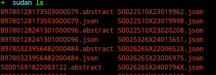

# web_spider

web spiders.

基本思路是 启动有头浏览器。半人工的登录（保持登录状态，绕过自动化登录的验证）半人工的爬取数据

### sciencedirect

```
./web_spider sciencedirect --help

www.sciencedirect.com

Usage:
  web_spider sciencedirect [flags]
  web_spider sciencedirect [command]

Available Commands:
  detail      single page
  list        search list page

Flags:
  -h, --help   help for sciencedirect

Global Flags:
  -i, --input string       Input file path
  -d, --input_dir string   Input dir path
      --ws                 use websocket

```

#### list

1. ./web_spider sciencedirect list

默认启动 chrome 来进行爬取

⚠️ 如果点击搜索 跳转到登录 或者 通过其他第三方跳转的登录也没办法登陆的情况下 使用第二种 --ws 方法

2. ./web_spider sciencedirect list --ws

```shell
# 0. 复制 chrome 的数据目录
cp -rf /Users/beer/Library/Application\ Support/Google/Chrome/Default /tmp/chrome
# 1. 启动 chrome 
Google\ Chrome -remote-debugging-port=9222 --user-data-dir=/tmp/chrome
```

使用启动的浏览器 解析 ``http://127.0.0.1:9222/json/version`` 获取 ws 接口


- 人工触发搜索词


- 代码自动收集指定API的 response

```go
go page.EachEvent(func(e *proto.NetworkResponseReceived) {
		respUrl := e.Response.URL

		if strings.HasPrefix(respUrl, s.domain) {
			s.log.Debugf("new resp url: %v", respUrl)
		}

		if strings.HasPrefix(respUrl, "https://www.sciencedirect.com/search/api") {
			s.log.Infof("sciencedirect api url: %s", respUrl)

			select {
			case s.saveChan <- saveTask{targetUrl: respUrl, reqId: e.RequestID}:
			case <-s.ctx.Done():
				s.log.Infof("context done, stop saving")
				return
			}
		}
	})()
```


#### detail


爬取详情页面的 Abstract

./web_spider sciencedirect detail --ws -d xxx

```
-d 参数为 list 的每个搜索词的输出文件
```

此命令解析 -d 输入的文件夹下的 json 文件 请求 item link 解析获取 Abstract 



